# TradeFlow

**Multi-horizon trend forecasting for NSE stocks.** A Streamlit dashboard on top of gradient-boosting models
trained on ~180 Indian stocks with technical, market-context and multi-timeframe features. The pipeline has
leakage audits, walk-forward validation and a cost-aware backtest.

[](https://tradeflowai.streamlit.app)


**🌐 Live app: [tradeflowai.streamlit.app](https://tradeflowai.streamlit.app)**

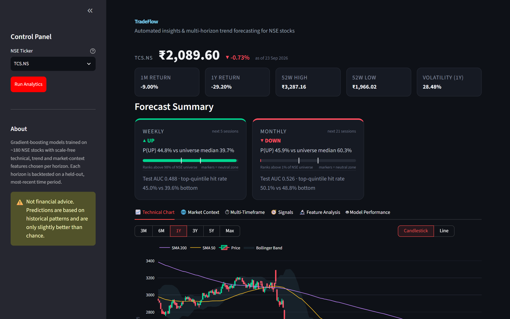

> **Not financial advice.** The models are only slightly better than chance (test ROC AUC 0.49–0.55). TradeFlow
> is a research and learning project. Don't use it as a trading signal.

---

## Contents

- [Features](#features)
- [Screenshots](#screenshots)
- [How to read a forecast](#how-to-read-a-forecast)
- [Quick start](#quick-start)
- [Results](#results)
- [Project layout](#project-layout)
- [Evaluation protocol](#evaluation-protocol)
- [Leakage controls](#leakage-controls)
- [Data availability](#data-availability)
- [Tech stack](#tech-stack)

## Features

- **Three horizons:** weekly (5 sessions), monthly (21) and yearly (252) forecasts, each from its own model and feature set.
- **Cross-sectional ranking:** each stock's P(UP) is ranked against the full ~180-stock NSE universe.
- **Market context:** NIFTY 50, sector index or leave-one-out peer composite, India VIX, USD/INR and relative strength.
- **Multi-timeframe view:** live 5m / 15m / 1h / daily indicators aligned to the prediction date.
- **Explainability:** per-forecast SHAP contributions ("Why the model says this") and global feature analysis (SHAP, gain, mutual information, permutation, correlation).
- **Honest evaluation:** a held-out test block, embargoed walk-forward CV, a point-in-time leakage audit, and a backtest with costs and slippage against an equal-weight benchmark.
- **Interactive charts:** candlestick or line chart with SMA 50/200, Bollinger Bands, volume, RSI and MACD.

## Screenshots

All screenshots are from the live app at [tradeflowai.streamlit.app](https://tradeflowai.streamlit.app), with TCS.NS as the example ticker.

**Home.** Pick any NSE ticker in the sidebar (`SYMBOL.NS`) and press **Run Analytics**.

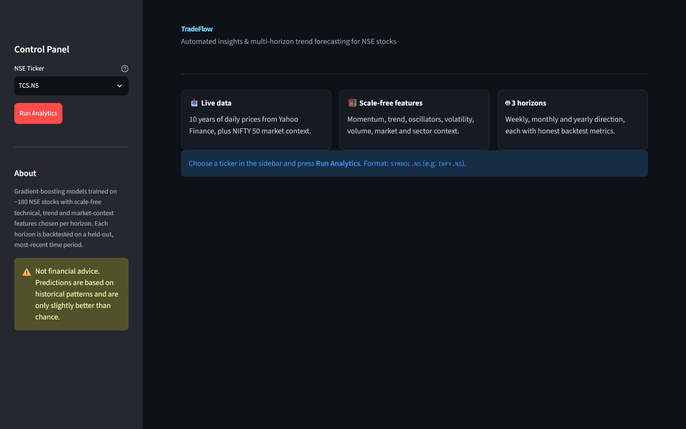

**Forecast summary.** Price, returns, 52-week range and volatility, then one card per horizon with P(UP), its rank
in the universe and the model's test-set scores.


| 📈 Technical chart | 🌐 Market context |
| --- | --- |
| 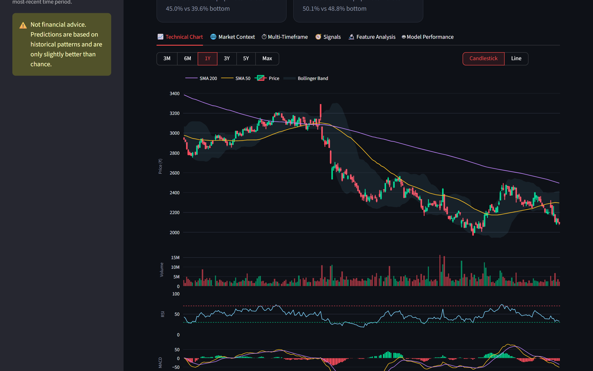 | 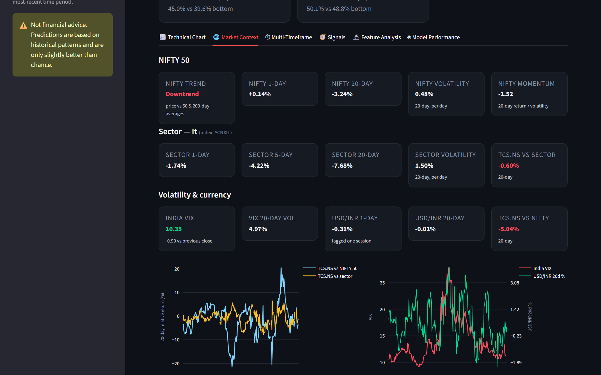 |
| Candlestick/line chart with SMA 50/200, Bollinger Bands, volume, RSI and MACD; 3M to Max ranges | NIFTY 50 trend, sector index, India VIX, USD/INR and the stock's relative strength |
| **⏱ Multi-timeframe** | **🧭 Signals** |
| 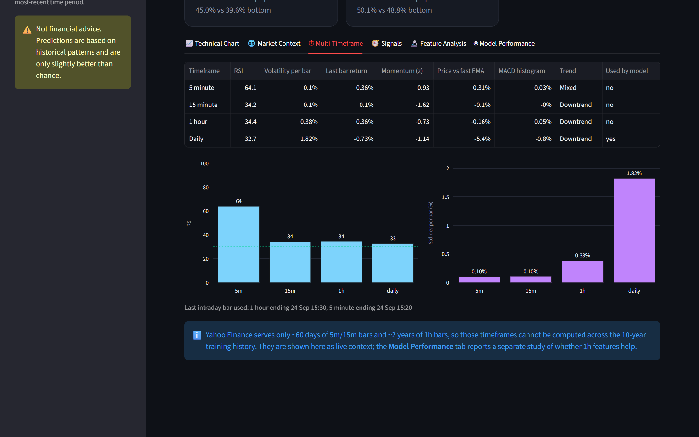 | 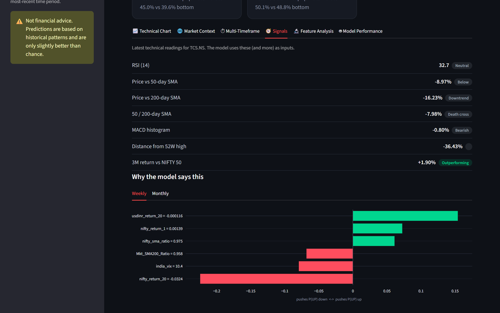 |
| RSI, volatility, momentum and trend on 5m / 15m / 1h / daily bars | Latest technical readings with plain-language tags |
| **🔍 Why the model says this** | **🔬 Feature analysis** |
| 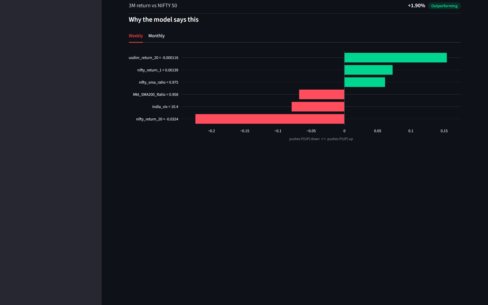 | 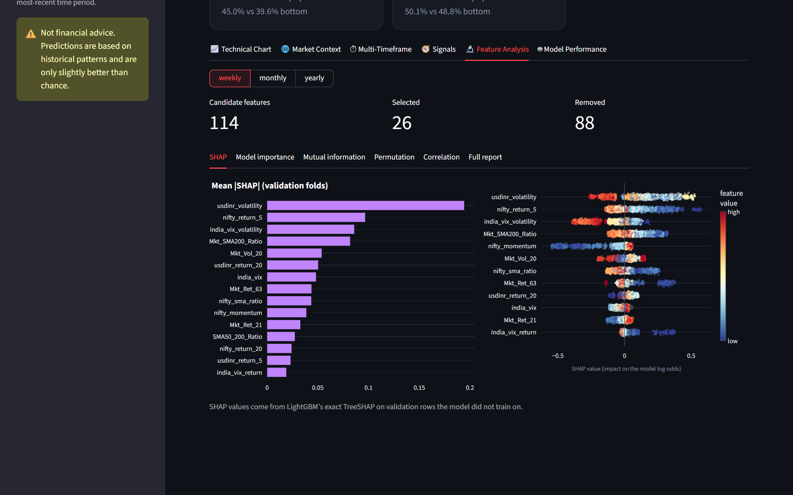 |
| Per-forecast SHAP contributions pushing P(UP) up or down | Global SHAP importance and beeswarm for each horizon |
| **🧮 Feature correlation** | **🤖 Model performance** |
| 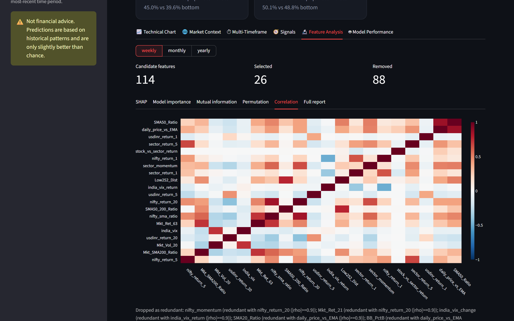 | 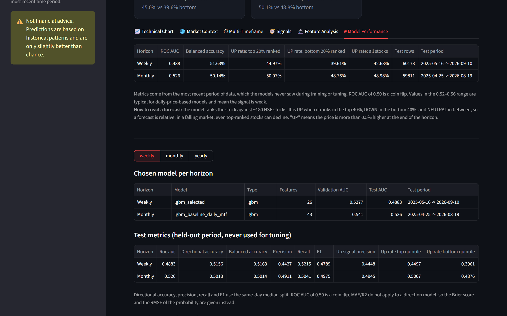 |
| Correlation heatmap of the selected features | Held-out test metrics and the chosen model per horizon |
| **🧪 Experiments** | **💹 Backtest** |
| 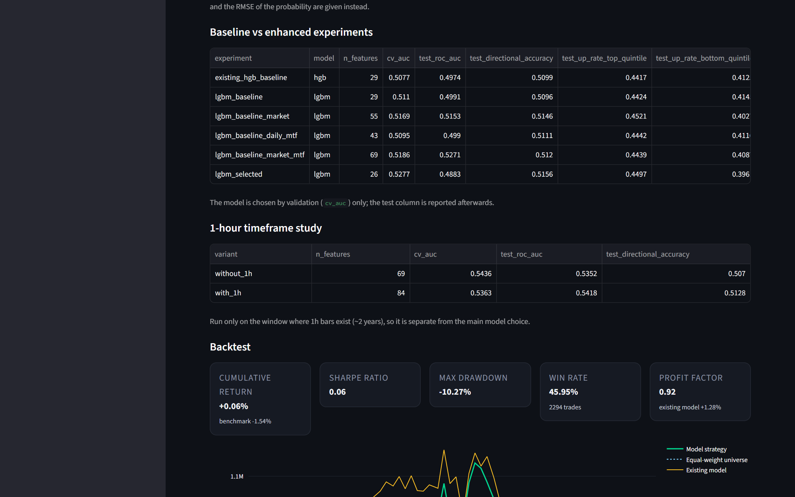 | 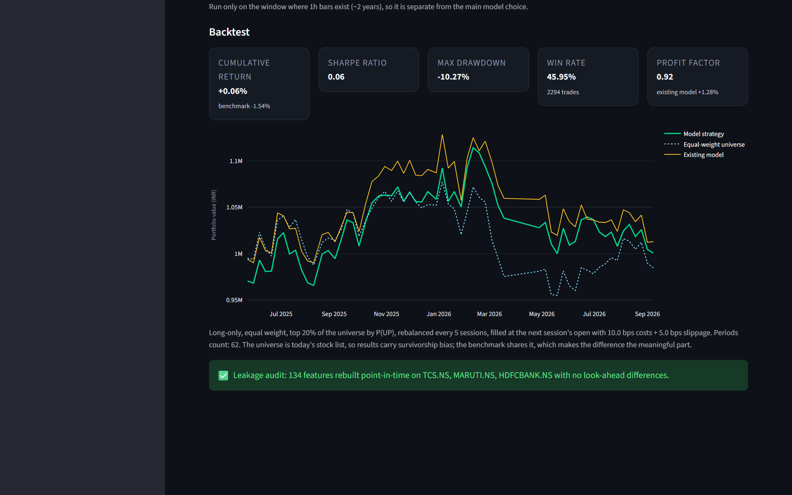 |
| Baseline vs enhanced feature sets and the 1h study | Equity curve vs the equal-weight universe and the leakage-audit result |

## How to read a forecast

The models rank stocks against each other, so a forecast is **relative**:

| Label | Meaning |
| --- | --- |
| **UP** | The stock ranks in the top 40% of the universe by P(UP) |
| **NEUTRAL** | Middle 20% |
| **DOWN** | Bottom 40% |

A stock labelled UP is ranked above its peers. That doesn't mean its price will rise: in a falling market, even a
top-ranked stock can decline. During market hours, forecasts use the last completed session's close.

## Quick start

```bash
git clone https://github.com/piyushp69/TradeFlow.git
cd TradeFlow
python -m venv .venv
# Windows: .venv\Scripts\activate    macOS/Linux: source .venv/bin/activate
pip install -r requirements.txt

streamlit run app.py       # dashboard on http://localhost:8501 (uses the trained models in models/saved_models/)
```

Trained models and reports are committed, so the dashboard works straight away. To retrain from scratch:

```bash
python trainer.py          # builds the dataset, trains, backtests and writes reports (~45 min)
```

| `trainer.py` flag | Effect |
| --- | --- |
| `--rebuild-data` | Rebuild the cached feature dataset |
| `--no-cache` | Re-download prices |
| `--horizons weekly monthly` | Train only a subset of horizons |
| `--no-intraday` | Skip intraday features |
| `--skip-1h-study` | Skip the separate 1h feature study |

## Results

All scores are from the held-out test block, which was never used for feature selection, tuning or model choice.

### Chosen models

The model for each horizon is chosen by walk-forward CV AUC alone; test AUC is reported afterwards.

| Horizon | Chosen experiment | Model | Features | CV AUC | Test AUC | Top-quintile UP rate | Bottom-quintile UP rate | Test period | Test rows |
| --- | --- | --- | --- | --- | --- | --- | --- | --- | --- |
| Weekly (5d) | `lgbm_selected` | LightGBM | 26 | 0.528 | 0.488 | 45.0% | 39.6% | 2025-05-16 → 2026-09-10 | 60,173 |
| Monthly (21d) | `lgbm_baseline_daily_mtf` | LightGBM | 43 | 0.541 | 0.526 | 50.1% | 48.8% | 2025-04-25 → 2026-08-19 | 59,811 |
| Yearly (252d) | `existing_hgb_baseline` | HistGradientBoosting | 29 | 0.523 | 0.547 | 51.8% | 51.3% | 2024-07-10 → 2025-09-16 | 53,476 |

### Feature-set experiments

Six candidate setups per horizon, shown as CV AUC / test AUC:

| Experiment | Features | Weekly | Monthly | Yearly |
| --- | --- | --- | --- | --- |
| `existing_hgb_baseline`: original 29 features, HistGB | 29 | 0.508 / 0.497 | 0.533 / 0.586 | **0.523** / 0.547 |
| `lgbm_baseline`: same features, LightGBM | 29 | 0.511 / 0.499 | 0.541 / 0.534 | 0.519 / 0.552 |
| `lgbm_baseline_market`: + NIFTY, sector, VIX, USD/INR | 55 | 0.517 / 0.515 | 0.498 / 0.514 | 0.514 / 0.543 |
| `lgbm_baseline_daily_mtf`: + daily multi-timeframe | 43 | 0.510 / 0.499 | **0.541** / 0.526 | 0.520 / 0.547 |
| `lgbm_baseline_market_mtf`: + market + multi-timeframe | 69 | 0.519 / 0.527 | 0.505 / 0.508 | 0.511 / 0.546 |
| `lgbm_selected`: feature-selected subset | 24–27 | **0.528** / 0.488 | 0.534 / 0.550 | 0.516 / 0.543 |

Bold marks the setup picked for each horizon. Weekly feature selection trimmed 114 candidate features to 26.

### 1-hour timeframe study

1h bars exist for only ~2 years, so this study runs separately, over that window only:

| Horizon | Variant | Features | CV AUC | Test AUC |
| --- | --- | --- | --- | --- |
| Weekly | without 1h | 69 | 0.544 | 0.535 |
| Weekly | with 1h | 84 | 0.536 | 0.542 |
| Monthly | without 1h | 69 | 0.551 | 0.604 |
| Monthly | with 1h | 84 | 0.553 | 0.603 |

Adding 1h features doesn't change the scores in any consistent way.

### Backtest

Long-only, top 20% of the universe by P(UP), equal weight, rebalanced every horizon, filled at the next session's
open with 10 bps costs + 5 bps slippage, starting from ₹10,00,000. The benchmark is the equal-weight universe.

| Horizon | Rebalances | Trades | Strategy return | Benchmark | Original-model return | Sharpe | Max drawdown | Win rate | Profit factor |
| --- | --- | --- | --- | --- | --- | --- | --- | --- | --- |
| Weekly | 62 | 2,294 | +0.1% | −1.5% | +1.3% | 0.06 | −10.3% | 46.0% | 0.92 |
| Monthly | 13 | 479 | +15.8% | +15.8% | +20.8% | 1.32 | −3.8% | 52.2% | 1.42 |
| Yearly | 1 | 37 | −0.8% | +1.3% | −0.8% | – | 0.0% | 32.4% | 0.83 |

The signal is weak. After costs, weekly beats the benchmark by ~1.6 points, monthly matches it and yearly (a single
rebalance) trails it. The original 29-feature HistGB model did as well or better in the weekly and monthly backtests.
The universe is today's stock list, so absolute returns carry survivorship bias. The benchmark has the same bias, so the
difference between the two is what matters.

**Leakage audit:** all 134 features were rebuilt point-in-time on TCS.NS, MARUTI.NS and HDFCBANK.NS, with no
look-ahead differences and no intraday alignment problems.

Full outputs are in [`reports/`](reports) (`backtest_*.json`, `equity_curve_*.csv`, `trades_*.csv`,
`experiments_*.csv`, `feature_selection_*.csv`, `leakage_audit.json`) and
[`models/saved_models/metrics.json`](models/saved_models/metrics.json).

## Project layout

| Path | Purpose |
| --- | --- |
| `app.py`, `ui/` | Streamlit dashboard |
| `trainer.py` | Orchestration: dataset -> audit -> experiments -> selection -> final models -> backtest |
| `data/fetcher.py` | Daily and intraday downloads, cleaning, on-disk cache, named loaders per source |
| `data/sectors.py` | Sector membership and which sectors have an official index |
| `features/technical.py` | Timeframe-agnostic indicators (RSI, MACD, ATR, EMA, momentum, regimes) |
| `features/indicators.py` | Original 29 baseline features and the labels (`add_targets`) |
| `features/market.py` | NIFTY, sector, India VIX, USD/INR and relative-strength features + alignment rules |
| `features/multitimeframe.py` | 5m / 15m / 1h / daily features aligned to each daily prediction row |
| `features/pipeline.py` | `build_feature_frame`, used by both training and the app |
| `features/leakage.py` | Point-in-time rebuild audit, target-leakage and alignment checks |
| `features/selection.py` | Correlation, mutual information, gain/split, permutation, SHAP, final selection |
| `models/training.py` | Splitting, walk-forward CV, model factories (HistGradientBoosting + LightGBM), metrics |
| `models/predictor.py` | Loads bundles, produces direction / percentile / SHAP explanation |
| `models/inference.py` | Live data assembly for one ticker (same feature builder as training) |
| `models/reports.py` | Reads `reports/` for the dashboard |
| `models/saved_models/` | Trained model bundles per horizon and `metrics.json` |
| `backtest/engine.py` | Cross-sectional long-only backtest with costs, slippage and a benchmark |
| `reports/` | Training outputs: backtests, equity curves, feature selection, leakage audit, predictions |

## Evaluation protocol

* The most recent 15% of dates is the **test block**. It is never used for feature selection, tuning or
  model choice, and is scored once per horizon.
* Model choice uses 4 **walk-forward folds** (expanding training window) inside the earlier data.
* Every training block ends `horizon_days` before the block it is evaluated on (**embargo**), so labels that
  look ahead cannot overlap the evaluation rows. The trainer asserts this.
* Metrics: ROC AUC, directional accuracy, precision/recall/F1 (same-day median split), Brier score, and the
  UP rate of the top vs bottom ranked quintile. MAE/RMSE/R² on price do not apply: the model predicts a
  direction, not a price.

## Leakage controls

A feature for date D may only use information available at the 15:30 IST close of D.

* `features/leakage.py` rebuilds every feature using only data that existed at several cutoff dates and
  compares it with the full-history build. Any difference fails the audit (`reports/leakage_audit.json`).
* USD/INR is lagged one session: its daily bar closes after the NSE close. NIFTY, sector indices, sector
  peers and India VIX trade in the same session and are joined on the exact date.
* Intraday features for date D come from the last bar of session D that ended by 15:30; a missing session
  is NaN, never a stale bar from an earlier day.
* Missing external data stays NaN instead of being forward-filled from stale values.
* Sector peer composites exclude the stock itself (leave-one-out).

## Data availability

Yahoo Finance serves ~60 days of 5m/15m bars and ~730 days of 1h bars, so intraday features cannot be
computed across the 10-year training history. The 5m/15m timeframes are therefore dashboard-only, and the
value of 1h features is measured in a separate study over the window where they exist
(`reports/intraday_1h_study_*.csv`). Only Bank Nifty, Nifty IT and Nifty Pharma have usable sector-index
history; other sectors use a leave-one-out equal-weight composite of their peers.

## Tech stack

Python · Streamlit · pandas / NumPy · scikit-learn · LightGBM · Plotly · yfinance · joblib

---

Built by [@piyushp69](https://github.com/piyushp69). Market data from Yahoo Finance; availability and accuracy are not guaranteed.
